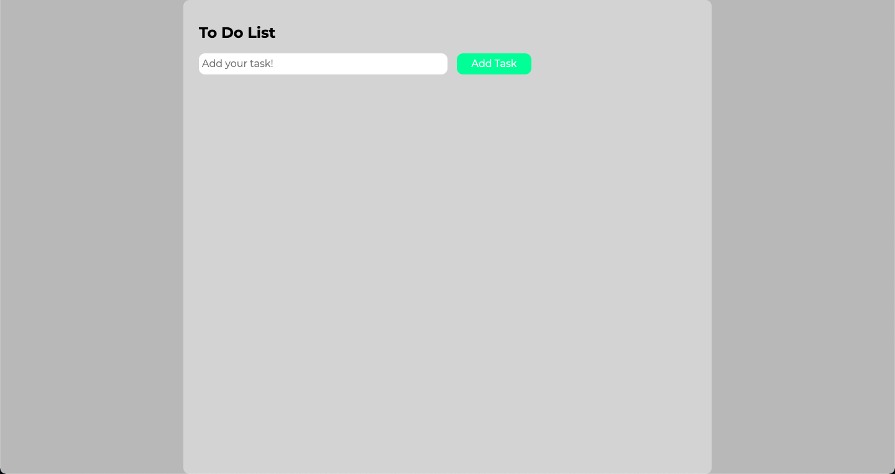
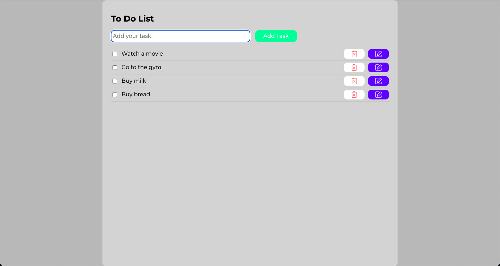
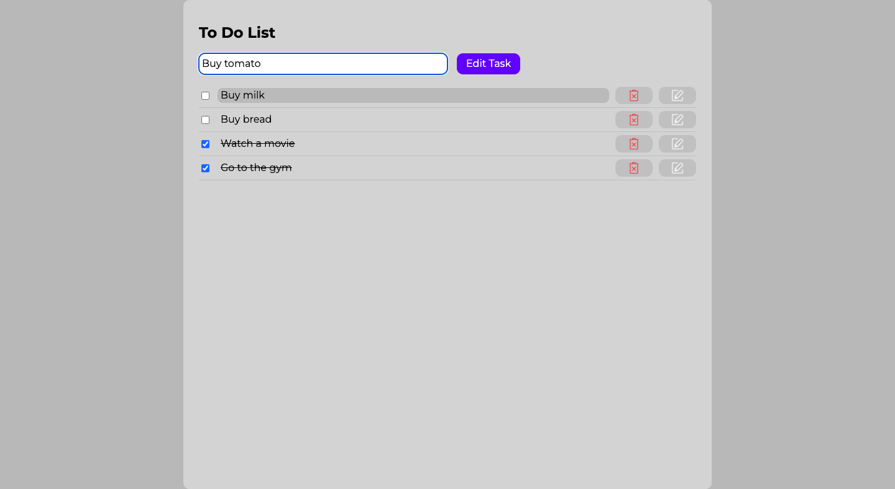
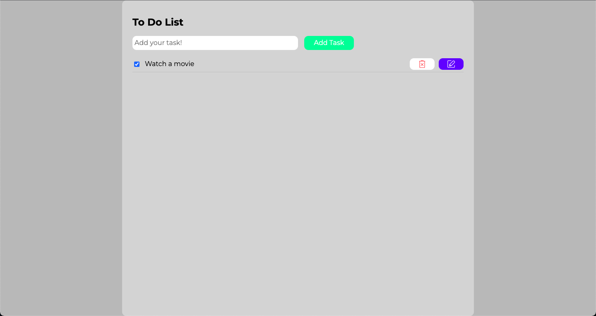

# To Do List

## Get Started

If you want to see the project without deploying it locally, you can follow this link to GitHub Pages: https://georgedeyneka.github.io/ToDoList

So, if you want to look at the project's code and deploy it, follow the steps below in the "Installation" section.

### Installation

1. Clone the repo
```sh
git clone https://github.com/GeorgeDeyneka/ToDoList.git
```
2. Install NPM packages
```sh
npm install
```
3. Run this command for a dev server. Navigate to `http://localhost:7070/`. The application will automatically reload if you change any of the source files.
```sh
npm run watch
```

## About project

This is a simple task list. I wrote it back in November in pure JavaScript and SCSS, but later I changed my mind about writing code.

So, in March, I built this project with Gulp, translated it to TypeScript, and completely refactored the code. I rewrote the code into classes and divided them into understandable methods.

When refactoring, I used the principles of KISS, DRY and the Single Responsibility principle.


### Built With

- 
- 
- 
- 
- 
- 

## Usage

### Main Page
<div>
  <ul>
    <li>
When you open the application, you see the main page.
    </li>
  </ul>
  </br>

</div>

</br>

---

### Add tasks
<div>
  <ul>
    <li>
You can add tasks by entering text and clicking the "Add Task" button.
    </li>
    </br>
    <li>
So, at the moment you have formed several tasks. Marking completed tasks, they will be crossed out and sent to the bottom of the list.
    </li>
  </ul>
  </br>

</div>

</br>

---

### Edit task
<div>
  <ul>
    <li>
By clicking on the edit button next to the task you need, you will see the button change to "Edit Task", and the old task text will be automatically inserted into the input field. When you edit a task, the other edit and delete buttons are disabled and the edited issue is highlighted.
    </li>
    </br>
    <li>
After you finish editing, just confirm it by clicking on the button. The edited task will remain in the list in the same place where it was before.
    </li>
  </ul>
  </br>

</div>

</br>

---

### Delete task
<div>
  <ul>
    <li>
If you need to delete a task, you can also do so by clicking the delete button next to the relevant task.
    </li>
  </ul>
  </br>

  </br>
  </br>
  <ul>
    <li>
And even if you close the tab and return to the application later, your tasks will be saved because they are stored in local storage.
    </li>
  </ul>
</div>

</br>

## Contributing

Contributions are what make the open source community such an amazing place to learn, inspire, and create. Any contributions you make are **greatly appreciated**.

If you have a suggestion that would make this better, please fork the repo and create a pull request. You can also simply open an issue with the tag "enhancement".

If you want to improve the project code, you need to:

1. Fork the Project
2. Create your Feature Branch (`git checkout -b feature/AmazingFeature`)
3. Commit your Changes (`git commit -m 'Add some AmazingFeature'`)
4. Push to the Branch (`git push origin feature/AmazingFeature`)
5. Open a Pull Request

Don't forget to give the project a star! Thanks again!


## My Contacts (Links)

- <a href="https://www.linkedin.com/in/george-deyneka-910003238/">
    
  </a> 
- <a href="https://t.me/Deyneka_George">
    
  </a> 
- <a href="mailto: zhoradeynecka@gmail.com">
    
  </a> 
